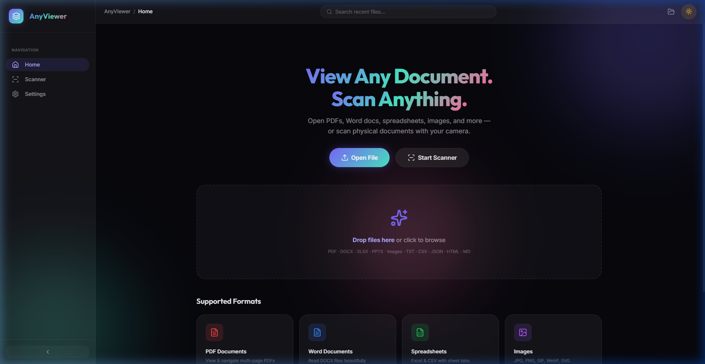

# AnyViewer 📄🔍

Seamlessly view and scan any document format entirely inside your browser using a modern local React engine.

---

## Why AnyViewer?

Tired of installing bulky local software to open different file formats? This application automates the workflow of document management by unifying PDFs, Word docs, Spreadsheets, and Physical Scans into one beautiful interface!



| The Old Way | AnyViewer Automation |
| :--- | :--- |
| **Separate Apps** for PDF, Word, Excel | **Unified Engine** handles all formats |
| **Phone Cameras** for blurry scans | **Built-in Scanner** with threshold filters |
| **Cloud Tracking** uploading your data | **100% Local** memory processing |
| **Static files** scattered in folders | **IndexedDB** recent file persistence |

---

## 🚀 Installation & Setup

AnyViewer relies on an incredibly powerful, self-hosted React engine to instantly render your documents without using cloud telemetry or expensive subscriptions.

**To use this application, you must install the node modules on your machine.**

### 1. Download the Engine
Clone our official repository to your machine.
```bash
git clone https://github.com/prakhyat798/AnyViewer.git
cd AnyViewer
```

### 2. Boot the Client
Once you have cloned the Engine onto your computer:
1. Run `npm install` to grab the dependencies.
2. Hit `npm run dev` in your terminal. Vite will silently boot the React instance in the background!
3. Open the provided `localhost` link to access the dashboard.

---

## 🔌 Key Features

### ✂️ Intelligent Format Parsers
* Extracts raw text from `.docx` using Mammoth and `.pptx` using JSZip.
* Preserves sheet tabs and row formatting while rendering massive `.xlsx` and `.csv` files.

### 📸 Smart Asset Management
```javascript
// File naming templates automatically manage your scan exports:
fileName: `AnyViewer_Scan_${Date.now()}.pdf`
```
* Custom grayscale and high-contrast neural filters.
* Multi-page PDF packing directly in the browser cache.

---

## 🔗 Usage Workflow

1. **Boot** ➞ Run `npm run dev`
2. **Drop** ➞ Drag a file completely offline into the UI.
3. **Scan** ➞ Hit "Start Scanner" to process physical notes.
4. **Filter** ➞ Apply Magic Color or Grayscale.
5. **Export** ➞ Automatically saved as a flawless PDF!

---

## 🌐 Compatibility

| Environment | Support |
| :--- | :--- |
| **Framework** | React 18, Vite |
| **Engine OS** | Win/Mac/Linux browsers |
| **Mobile Web** | Fully Responsive UI |

*Note on Mobile: The application works flawlessly on mobile browsers. You can point your phone to your desktop's local IP address over Wi-Fi to use your phone's camera as the native scanner!*

---

## 🤝 Contributing

Help improve multi-format detection, batch processing, or UI mechanics! Feel free to suggest changes via PRs or open an issue using our provided `.github` templates.

---

## 📄 License

MIT License — See [LICENSE](./LICENSE).

---

## 💡 Why This Name?

AnyViewer combines:
* **Any** (universal format acceptance)
* **Viewer** (displaying them beautifully)

---

## 🌌 Support

Found a bug? Want to help keep the lights on for this open source architecture?

* 🐛 **GitHub Issues**: [Issue Tracker](https://github.com/prakhyat798/AnyViewer/issues)
* 💻 **Repository**: [AnyViewer](https://github.com/prakhyat798/AnyViewer)

---

> **From the Developer**
> *"This application was born from countless hours spent opening bloated software just to read a simple Word Doc or PDF. What started as an experiment with PDF.js evolved into an obsession with building a massive localized document engine to bridge analog and digital knowledge. May your documents live forever in both paper and pixels!"*
