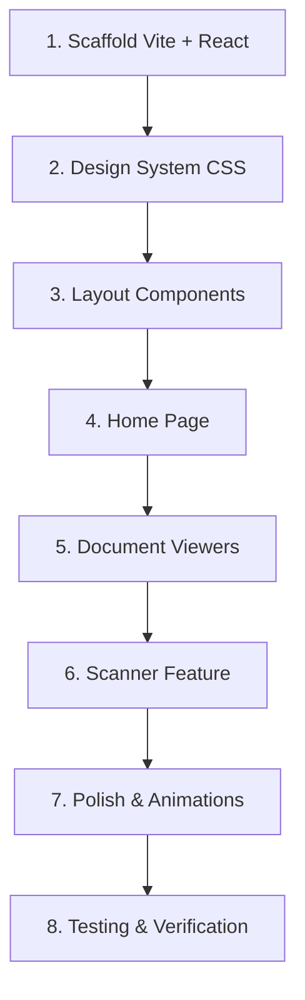

# NovaDocs — Universal Document Viewer & Scanner

A breathtaking, all-in-one document viewer and scanner web application inspired by **OxygenOS 16's Liquid Glass** design and **Material You** dynamic theming. The app should feel alive — bouncy, fluid, and premium.

---

## App Name: **NovaDocs**

## Tech Stack

| Layer | Technology | Why |
|:---|:---|:---|
| **Framework** | Vite + React 19 | Fast HMR, modern bundling |
| **Styling** | Vanilla CSS + CSS Custom Properties | Full control over animations & theming |
| **Animations** | Framer Motion | Spring physics, layout animations, gestures |
| **PDF Rendering** | `react-pdf` (wraps pdf.js) | Industry standard, open source |
| **DOCX Rendering** | `mammoth.js` | Converts .docx → HTML |
| **XLSX Rendering** | `SheetJS (xlsx)` | Parses spreadsheets to JSON/HTML |
| **PPTX Rendering** | Custom parser + `pptxgenjs` or HTML slides | Parse XML slides to rendered views |
| **Image Viewing** | Native `` + zoom/pan gestures | Built-in, fast |
| **Text/Code** | Syntax-highlighted `<pre>` blocks | Lightweight |
| **Scanner** | `jscanify` + WebRTC camera | Client-side edge detection & perspective correction |
| **PDF Export** | `jsPDF` + `html2canvas` | Export scans as PDF |
| **Icons** | Lucide React | Clean, modern icon set |
| **Fonts** | Google Fonts — **Outfit** (headings) + **Inter** (body) | Premium, modern typography |

---

## Design Language

### OxygenOS 16 "Liquid Glass" + Material You Fusion

- **Glassmorphism layers**: Frosted glass cards with `backdrop-filter: blur()` and subtle translucent backgrounds
- **Dynamic color theming**: Extract dominant colors from opened documents/images and apply as accent theme (Material You style)
- **Bouncy spring animations**: All transitions use spring physics (`cubic-bezier(0.68, -0.55, 0.265, 1.55)`) for that signature OxygenOS overshoot feel
- **Liquid morphing shapes**: Animated blob backgrounds that subtly shift and breathe
- **Micro-interactions everywhere**: Button presses scale down then bounce, page transitions slide with spring, sidebar reveals with elastic motion
- **Pill-shaped elements**: Rounded, organic shapes for buttons, tabs, and navigation items
- **Dark mode first**: Rich dark gradients with vibrant accent colors that glow
- **Light mode**: Clean, airy whites with soft colored shadows

### Color Palette

| Token | Dark Mode | Light Mode |
|:---|:---|:---|
| `--bg-primary` | `#0a0a0f` | `#f8f9fc` |
| `--bg-surface` | `rgba(255,255,255,0.04)` | `rgba(0,0,0,0.02)` |
| `--bg-glass` | `rgba(255,255,255,0.06)` | `rgba(255,255,255,0.7)` |
| `--accent` | `#7c6aff` (vivid violet) | `#5b4cc4` |
| `--accent-glow` | `rgba(124,106,255,0.3)` | `rgba(91,76,196,0.15)` |
| `--text-primary` | `#eee` | `#1a1a2e` |
| `--text-secondary` | `rgba(255,255,255,0.5)` | `rgba(0,0,0,0.5)` |
| `--success` | `#4ade80` | `#16a34a` |
| `--warning` | `#fbbf24` | `#d97706` |
| `--danger` | `#f87171` | `#dc2626` |

---

## Proposed Changes

### 1. Project Scaffolding

#### [NEW] Vite + React Project
- Initialize with `npx -y create-vite@latest ./ --template react`
- Install dependencies: `react-pdf`, `mammoth`, `xlsx`, `framer-motion`, `lucide-react`, `jspdf`, `html2canvas`

---

### 2. Design System (`src/styles/`)

#### [NEW] `src/index.css` — Global design tokens
- CSS custom properties for all colors, spacing, typography, shadows, radii
- Dark/light mode via `[data-theme]` attribute
- Base reset and typography styles
- Animation keyframes: `bounceIn`, `slideUp`, `fadeGlass`, `breathe`, `morphBlob`
- Glassmorphism utility classes

#### [NEW] `src/styles/animations.css` — Spring animation library
- Reusable bouncy transition classes
- Page transition keyframes
- Micro-interaction classes (press, hover, reveal)

---

### 3. Core Components (`src/components/`)

#### [NEW] `src/components/Layout/Sidebar.jsx`
- Collapsible navigation sidebar with glassmorphism
- Navigation items: Home, Recent Files, Scanner, Settings
- Animated expand/collapse with spring physics
- File type filter pills

#### [NEW] `src/components/Layout/TopBar.jsx`
- App title "NovaDocs" with gradient text
- Search bar with animated expand
- Theme toggle (dark/light) with morphing sun/moon icon
- File open button

#### [NEW] `src/components/Layout/AppShell.jsx`
- Main layout wrapper with sidebar + content area
- Animated background blobs that breathe
- Route-based content switching

---

### 4. Document Viewer Components (`src/components/Viewer/`)

#### [NEW] `src/components/Viewer/DocumentViewer.jsx`
- Master viewer component that detects file type and renders appropriate sub-viewer
- File type detection by extension and MIME type
- Loading states with skeleton shimmer animation

#### [NEW] `src/components/Viewer/PDFViewer.jsx`
- Full PDF rendering with page navigation
- Zoom in/out with pinch gestures
- Thumbnail sidebar with bouncy scroll
- Page transition animations

#### [NEW] `src/components/Viewer/DocxViewer.jsx`
- Renders DOCX files using mammoth.js → HTML
- Styled output in a beautiful reading view

#### [NEW] `src/components/Viewer/SpreadsheetViewer.jsx`
- Renders XLSX/CSV using SheetJS
- Beautiful table with alternating row colors and glassmorphism headers
- Sheet tab navigation

#### [NEW] `src/components/Viewer/ImageViewer.jsx`
- Full image display with zoom, pan, rotate
- EXIF data display
- Supports JPG, PNG, GIF, WebP, SVG

#### [NEW] `src/components/Viewer/TextViewer.jsx`
- Plain text and code file viewer
- Monospaced font with line numbers
- Auto-detect language for syntax highlighting

---

### 5. Scanner Feature (`src/components/Scanner/`)

#### [NEW] `src/components/Scanner/ScannerView.jsx`
- Camera viewfinder with live preview
- Real-time document edge detection overlay (glowing border)
- Auto-capture when document is detected
- Manual capture button with bouncy press animation

#### [NEW] `src/components/Scanner/ScanPreview.jsx`
- Preview of captured/scanned image
- Crop & adjust corners with draggable handles
- Image filters: Grayscale, High Contrast, Color, Original
- Retake / Save / Export as PDF buttons

#### [NEW] `src/components/Scanner/ScanGallery.jsx`
- Multi-page scan management
- Reorder pages with drag and drop
- Combine multiple scans into one PDF
- Animated card stack view

---

### 6. Home / Landing Page (`src/components/Home/`)

#### [NEW] `src/components/Home/HomePage.jsx`
- Hero section with animated gradient text: "View Any Document. Scan Anything."
- Recent documents grid with glassmorphism cards
- Quick actions: Open File, Start Scanner
- Drag & drop zone with animated dashed border
- File type stats (pie chart or icon grid)

---

### 7. Shared UI Components (`src/components/UI/`)

#### [NEW] `src/components/UI/GlassCard.jsx`
- Reusable glassmorphism card with hover lift + glow

#### [NEW] `src/components/UI/Button.jsx`
- Pill-shaped buttons with bouncy press animation
- Variants: primary (gradient), secondary (glass), danger, ghost

#### [NEW] `src/components/UI/Modal.jsx`
- Full-screen modal with backdrop blur
- Spring-animated entry/exit

#### [NEW] `src/components/UI/Toast.jsx`
- Notification toasts that slide in with spring bounce
- Auto-dismiss with smooth exit

#### [NEW] `src/components/UI/FileDropZone.jsx`
- Drag & drop area with animated border and icon
- Visual feedback on drag over

#### [NEW] `src/components/UI/ThemeToggle.jsx`
- Animated dark/light mode toggle with morphing icon

---

### 8. App Entry (`src/`)

#### [MODIFY] `src/App.jsx`
- Root app component with theme provider
- Route management (Home, Viewer, Scanner)
- Global animation provider (Framer Motion `AnimatePresence`)

#### [MODIFY] `src/main.jsx`
- Mount app with StrictMode
- Import global styles

---

## User Review Required

> [!IMPORTANT]
> **Framework choice**: I'm proposing **Vite + React** for this app due to the complexity of document rendering, state management, and animation requirements. A vanilla HTML/JS approach would be extremely difficult to maintain at this scale. Please confirm this is acceptable.

> [!IMPORTANT]
> **PPTX support**: Full PowerPoint rendering in the browser is very complex. I propose a simplified approach where we parse the XML structure and render slides as styled HTML cards, which won't be pixel-perfect but will show content. Is this acceptable, or should we skip PPTX for now?

> [!WARNING]
> **Scanner feature requires HTTPS**: The camera-based scanner uses `getUserMedia()` which only works on HTTPS or localhost. During development on `localhost` this works fine, but for deployment you'll need HTTPS.

## Open Questions

> [!IMPORTANT]
> 1. **App name**: I'm proposing **"NovaDocs"** — does this work for you, or do you have a preferred name?
> 2. **File storage**: Should files be stored in browser (IndexedDB) for recent documents, or is this purely open-and-view?
> 3. **OCR**: Should the scanner include text recognition (OCR) on scanned documents? This would add significant complexity but is very useful.

---

## Verification Plan

### Automated Tests
- Run `npm run build` to verify production build compiles
- Run dev server and test in browser

### Manual Verification (via Browser)
1. **File Opening**: Test opening PDF, DOCX, XLSX, images, and text files
2. **Theme Toggle**: Verify dark/light mode switching with smooth animations
3. **Scanner**: Test camera access and document scanning (requires camera)
4. **Animations**: Verify all bounce/spring animations feel fluid at 60fps
5. **Responsive**: Test on mobile-width viewports
6. **Drag & Drop**: Test file drag and drop functionality

---

## Implementation Order

Estimated total: ~25-30 files across components, styles, and utilities.
